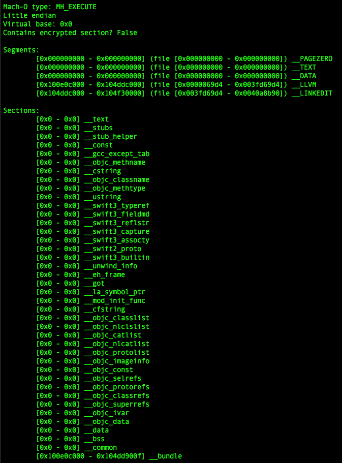
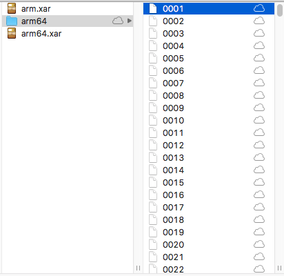
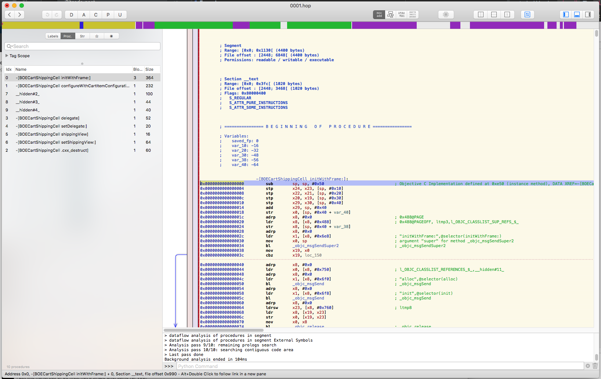
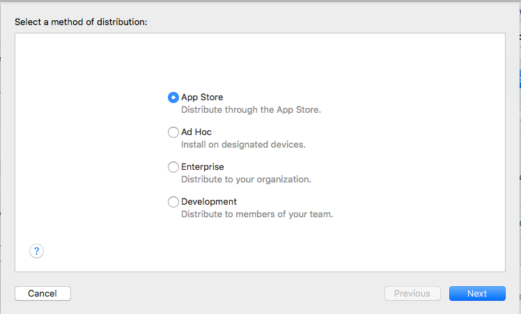
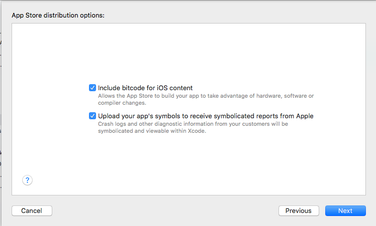

# The Anatomy of a Bitcode App

## Introduction

To analyze a third-party iOS app, we first need a copy of the application in a format which we can
read data from. When downloading an app from the App Store, each binary within the app package is
encrypted via a mechanism called FairPlay. This system ensures that iOS apps downloaded from the
store can only run on the devices for which they are downloaded from. While there are
methods to circumvent this protection, they are not relevant here.

When an app is encrypted via this system, there are telltale signs that it has been encrypted.
Specifically, the binary's load commands will contain a special command
giving some information about the encryption status: `LC_ENCRYPTION_INFO`, or `LC_ENCRYPTION_INFO_64`

The `LC_ENCRYPTION_INFO` provides two important pieces of data: the offset where the
encrypted data begins, and the size of the encrypted region. Typically, the
encrypted region will overlap with the contents of the `__text` section, which is the
section designated for executable code. Thus, when a binary is encrypted, the
assembly code it contains will not be readable, and we can detect this occuring via the values of the
`LC_ENCRYPTION_INFO` load command's offset and size fields.

Recently, we encountered a few apps which seemed to be encrypted in some format we did not
recognize. The binaries within these app packages did not contain an `LC_ENCRYPTION_INFO`
command indicating they were encrypted, but the binaries didn't seem to contain
'valid' data. For example, when using in-house Mach-O analysis tools, the binaries reported a
virtual memory base of `0x0`, which is far from the typical of `0x100000000`]

Additionally, the binary's string table also seemed to contain malformed data;
the string table had a reported size of _8_ bytes, which is far too small to be a sane value.

Attempting to analyze any of these binaries with a disassembler failed utterly. The disassemblers got far
enough to recognize that the binaries were unencrypted Mach-O's, but weren't able to detect that they contained
invalid data.

## Let's take a closer look!

The first step is to do some preliminary analysis of the sections within the binary, to see
if anything out of the ordinary sticks out.



Right away, anomalies stick out. Let's go one at a time:

Firstly, the binary has a virtual address base of `0x000000000`. Conventionally, arm64 apps have a virtual base of
`0x100000000`, so this is a good tip-off that something is amiss.

Additionally, the `__PAGEZERO` section is apparently emtpy and takes up 0 bytes. As this segment is used as a protection from a
program accessing very low memory (such as `NULL`), this is abnormal. As we look down the segment list, we can see all the other
standard segments declare a zero-size as well.

## Except...

That `__LLVM` segment is new! Additionally, if we look at the section list, we notice one that doesn't exist in typical binaries:
`__bundle`. The `__LLVM` segment declares it places data from `0x100e0c000` to `0x104ddc000`, and the `__bundle` section places data
from `0x100e0c000` to `0x104dd900f`. These two ranges overlap! This is a great hint that they'll contain something interesting
that could shed some light on the format of this Mach-O.

## Let's check out these new sections!

To read the file data contained by the `__LLVM` section, we need to know its location within the binary file. As you can see, its
file data is from offset `0x0000069d4` to `0x003fd69d4`.

```
$ philliptennen@Phillips-MBP ~/P/strongarm-ios> hexdump -C -s 0x69d4 -n 4096 BadBinary
000069d4  00 00 00 00 00 00 00 00  00 00 00 00 00 00 00 00  |................|
*
000079d4
```

All zeroes... What if we keep reading?

```
000069d4  00 00 00 00 00 00 00 00  00 00 00 00 00 00 00 00  |................|
*
00008b94  00 00 00 00 00 00 00 00  00 00 00 00 78 61 72 21  |............xar!|
00008ba4  00 1c 00 01 00 00 00 00  00 01 c1 94 00 00 00 00  |................|
00008bb4  00 14 f5 70 00 00 00 01  78 da ac 57 cb 76 da 30  |...p....x..W.v.0|
```

Ah-ha! The data contains `xar!` in hex, which is the magic value for [XAR archives](https://en.wikipedia.org/wiki/Xar_(archiver)). As it turns out, there is one
`.xar` archive for each architecture in the Mach-O.
What happens if we pull this data from the binary into its own file and interpret it as a .xar?



## Now we're getting somewhere!

In this case, the binary's arm64 xar archive contained 1,929 mystery files. What could these be?

Let's look at one of them:
```
$ philliptennen@Phillips-MBP ~/P/strongarm-ios> hexdump -C -n 64 archives/arm64/0001
00000000  de c0 17 0b 00 00 00 00  14 00 00 00 4c 43 00 00  |............LC..|
00000010  ff ff ff ff 42 43 c0 de  35 14 00 00 07 00 00 00  |....BC..5.......|
00000020  62 0c 30 24 94 96 a6 a5  f7 d7 7f 4f d3 3e ed df  |b.0$.......O.>..|
00000030  bd 6f ff b4 10 05 c8 14  00 00 00 00 21 0c 00 00  |.o..........!...|
```

Some [quick googling](https://github.com/radare/radare2/issues/2778) tells us that the first word of this
file, `0xdec0170b`, is a header for LLVM bitcode. It seems to be the case that all of these 2000 files
are individual bitcode compilation units.

## Can we turn these back into an analyzable binary?

Bitcode is effectively LLVM IR. Thus, to transform it into assembly code, we must, literally, compile it.

The LLVM toolchain distribution includes [a cool called llc](https://llvm.org/docs/CommandGuide/llc.html)
to compile bitcode (IR) to assembly or an object file.

A simple script will compile all the bitcode in the archive:

```bash
#!/bin/bash
for file in archives/arm64/*
do
    llc -filetype=obj "$file" &
done
```

This will produce one `arm64 .o` for each compilation unit in the archive.

Let's throw one of these in a disassembler and see what happens:



**Success!**

Each of the compilation units was successfully transformed into a standard Mach-O file with compiled code!

We should now be able to magically link all of these together into a happy, unified app binary:

```
$ philliptennen@Phillips-MBP ~/P/strongarm-ios> clang -arch arm64 archives/arm64/*.o -o GoodBinary
```

Unfortunately, this produces a spew of linker errors:


Many of these are caused by the symbols from app frameworks not being passed to clang, so it cannot
resolve imported symbols from the target binary. We can get rid of them by passing clang the bitcode frameworks.

A few linking errors persist, but it's a matter of time before they're resolved.

## So... What Happened?

To summarize, we received a binary containing LLVM bitcode rather than a complete, compiled Mach-O.
This is caused when these two options are selected when exporting an archived app from Xcode:




If Ad Hoc distribution is selected, or 'Include bitcode for iOS content' is deselected,
the app is exported as a typical, compiled Mach-O. Only if both 'App Store' and 'Include bitcode
for iOS content' are selected will the app ship as this sort of archive.

Now that we understand this format, it's trivial to detect when it occurs, and to direct customers
to the proper steps to prepare an archive that we are able to work with. Still, the process of
understanding this format and figuring out what was going on with these 'strange' binaries produced
a great couple hours of fun for Phillip and Ethan. In the final step of passing the IR through `llc`,
we were effectively compiling a 3rd party app without the source code, which is very cool. It's clear to
see why Apple is encouraging developers to submit mid-pass compiler IR to them, and it's interesting
to find out exactly how it works.
