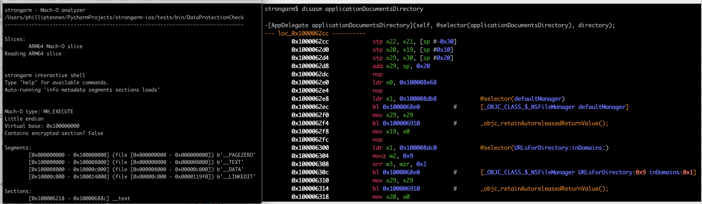

strongarm
-----------------

[](https://shields.io/)

*strongarm* is a full-featured, cross-platform Mach-O analysis library.

strongarm is production-ready and is used throughout DataTheorem's iOS static analyzer stack.



This repo contains multiple tools to explore strongarm and the API. In the `scripts` folder,
several popular Mach-O analysis tools have been reimplemented in strongarm, to demonstrate real API usage. As strongarm is cross-platform, 
all of these tools are as well:

- `strongarm-cli`: Static analysis REPL (try me!)
- `class-dump`: Dump the Objective-C class information from a Mach-O with Objective-C declaration syntax
- `insert_dylib`: Add a load command to a Mach-O
- `dsc_symbolicate`: Given a dyld_shared_cache, generate a symbol map from the embedded system images
- `nm`: List the symbol table of a Mach-O
- `lipo`: Thin or fatten Mach-O files and slices
- `hexdump`: Output the hex content of a byte range in a file
- `strings`: Output the C-strings in a Mach-O
- `dump_entitlements`: Print the code-signing information
- `bitcode_retriever`: Extract the XAR archive containing LLVM bitcode from a Mach-O


Features
-----------

- Access and cross-reference Mach-O info via an API
- Dataflow analysis
- Function-boundary detection

### Mach-O parsing:

- Metadata (architecture, endianness, etc)
- Load commands
- Symbol tables
- String tables
- Code signature
- APIs to lookup metadata/XRefs of an address
- Dyld info

### Mach-O analysis:

- Function boundary detection & disassembly
- Track constant data movement in assembly
- Read Objective-C info (classes, categories, protocols, methods, ivars, etc)
- Cross-reference addresses to imported/exported symbols
- Dyld bound symbols & implementation stubs
- Parse constant NSStrings and C strings
- Basic block analysis

### Mach-O editing:

- Load command insertion
- Write Mach-O structures
- Byte-edit binaries

Installation
-----------

strongarm is supported on macOS and Linux.

```bash
# Via pip
$ pip install strongarm-ios

# Or, for local development
$ git clone ...
$ cd strongarm-ios/
$ pipenv shell
$ pipenv install
```

Quickstart
-----------

Pass an input file to `MachoParser`, which will read a Mach-O or FAT and provide access to individual `MachoBinary` slices.

```python
import pathlib
# Load an input file
from strongarm.macho import MachoParser
parser = MachoParser(pathlib.Path('~/Documents/MyApp.app/MyApp'))
# Read the ARM64 slice and perform some operations
binary = parser.get_arm64_slice()   # type: MachoBinary
print(binary.get_entitlements().decode())
print(hex(binary.section_with_name('__text','__TEXT').address))
```

Advanced analysis
-----------------

Some APIs which require more memory or cross-referencing are available through `MachoAnalyzer`

```python
binary: MachoBinary = macho_parser.get_arm64_slice()
# A MachoAnalyzer wraps a binary and allows deeper analysis
analyzer = MachoAnalyzer.get_analyzer(binary)

# Find all calls to -[UIAlertView init] in the binary
print(analyzer.objc_calls_to(["_OBJC_CLASS_$_UIAlertView"], ["init"], requires_class_and_sel_found=False))

# Print some interesting info
print(analyzer.imported_symbol_names_to_pointers)   # All the dynamically linked symbols which will be bound at runtime
print(analyzer.exported_symbol_names_to_pointers)   # All the symbols which this binary defines and exports
print(analyzer.get_functions())                     # Entry-point list of the binary. Each of these can be wrapped in an ObjcFunctionAnalyzer
print(analyzer.strings())                           # __cstring segment
print(analyzer.get_imps_for_sel('viewDidLoad'))     # Convenience accessor for an ObjcFunctionAnalyzer

# Print the Objective-C class information
for objc_cls in analyzer.objc_classes():
    print(objc_cls.name)
    for objc_ivar in objc_cls.ivars:
        print(f'\tivar: {objc_ivar.name}')
    for objc_sel in objc_cls.selectors:
        print(f'\tmethod: {objc_sel.name} @ {hex(objc_sel.implementation)}')
```

Code analysis
--------------

Once you have a handle to a `FunctionAnalyzer`, representing a source code function, you can analyze the code:

```python
from strongarm.objc import ObjcFunctionAnalyzer
binary: MachoBinary = macho_parser.get_arm64_slice()
analyzer = MachoAnalyzer.get_analyzer(binary)
function_analyzer = ObjcFunctionAnalyzer.get_function_analyzer_for_signature(binary, 'ViewController', 'viewDidLoad')
print(function_analyzer.basic_blocks)   # Find the basic block boundaries

# Print some interesting info about Objective-C method calls in the function
for instr in function_analyzer.instructions:
    if not instr.is_msgSend_call:
        continue
    
    # In an Objective-C message send, x0 stores the receiver and x1 stores the selector being messaged.
    classref = function_analyzer.get_register_contents_at_instruction('x0', instr)
    selref = function_analyzer.get_register_contents_at_instruction('x1', instr)
    
    class_name = analyzer.class_name_for_class_pointer(classref.value)
    selector = analyzer.selector_for_selref(selref.value).name
   
    # Prints "0x100000000: _objc_msgSend(_OBJC_CLASS_$_UIView, @selector(alloc));"
    print(f'{hex(instr.address)}: {instr.symbol}({class_name}, @selector({selector}));')
```

Modifying Mach-O's
--------------

You can also modify Mach-O's by overwriting structures or inserting load commands:
```python
# Overwrite a structure
binary: MachoBinary = macho_parser.get_arm64_slice()
new_symbol_table = MachoSymtabCommand()
new_symbol_table.nsyms = 0
modified_binary = binary.write_struct(new_symbol_table, binary.symtab.address, virtual=True)

# Add a load command
modified_binary = modified_binary.insert_load_dylib_cmd('/System/Frameworks/UIKit.framework/UIKit')

# Write the modified binary to a file
MachoBinary.write_binary(pathlib.Path(__file__).parent / 'modified_binary')
```

`MachoBinary` provides several functions to faciliate binary modifications.

As modifying a `MachoBinary` may invalidate its public attributes, these APIs return a new `MachoBinary` object,
which is re-parsed with the edits.

```python
# Write raw bytes or Mach-O structures to a binary
MachoBinary.write_bytes(self, data: bytes, address: int, virtual=False) -> 'MachoBinary'
MachoBinary.write_struct(self, struct: Structure, address: int, virtual=False) -> 'MachoBinary'

# Insert a load command
MachoBinary.insert_load_dylib_cmd(dylib_path: str) -> 'MachoBinary'

# Flush a modified slice to a thin Mach-O file, or a list of slices to a FAT Mach-O file:
MachoBinary.write_binary(self, path: pathlib.Path) -> None
@staticmethod
MachoBinary.write_fat(slices: List['MachoBinary'], path: pathlib.Path) -> None
```

License
------------

AGPL license
