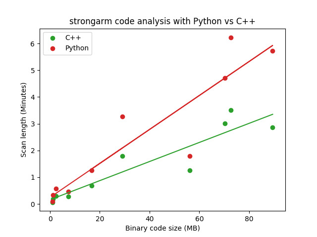
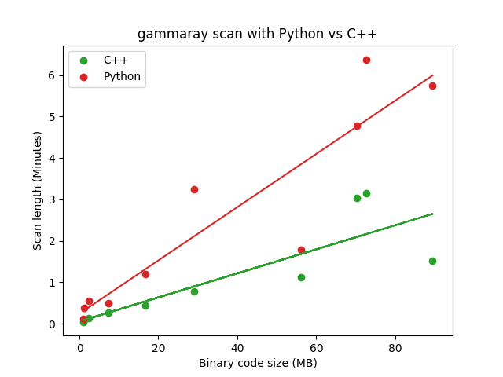

strongarm dataflow
==================

"Gotta go fast"
		- Sonic

Overview
--------

I propose a modification to strongarm in which the two most computationally expensive static analysis tasks are converted to a C++ Python extension, which exists within the strongarm module and is plug-and-play with the existing codebase.

Specifically, these two utilities will be converted to C++ and exposed via a compatible interface:

`ObjcFunctionAnalyzer.get_register_contents_at_instruction`. Given a desired CPU register and execution point, perform dataflow analysis via backwards program slicing to determine the value of the register at runtime.

`MachoAnalyzer._find_function_boundary`. Given a virtual address entry point containing machine code, identify the last statement which is part of the logical function unit. 

Interface specification
-----------------------

To all clients, the interface remains exactly the same. strongarm's existing functions will call through to the C++ extension:

```python
def get_register_contents_at_instruction(self, register: str, instruction: ObjcInstruction) -> RegisterContents:
	return get_register_contents_at_instruction_fast(register, self, instruction)
```
```python
def get_function_instructions(self, start_address: int) -> List[CsInsn]:
	# ...
	end_address = determine_function_boundary(bytecode, start_address)
	# ...
```

The exact prototypes for the two new public methods are:

```c++
// get_register_contents_at_instruction_fast(desired_register: str, function_analyzer: ObjcFunctionAnalyzer, instruction: ObjcInstruction) -> RegisterContents
Object* get_register_contents_at_instruction_fast(PyObject* self, PyObject* args);

// determine_function_boundary(bytecode: bytes, start_address: int) -> int
PyObject* determine_function_boundary(PyObject* self, PyObject* args);
```

Benefits
-------------------

The original Python code did not use any esoteric or obscure features of Python. The translated C++ code does not use any advanced features of C++. All data structures used are simple and common. There is a rough 1:1 translation of ideas from one to the other, and the new code should be understandable for any general-purpose programmer.

By significantly reducing the time it takes to scan an app, everyone involved with scanning iOS apps regains productivity. While apps are scanned with gammaray en masse in the cloud, I know I still regularly scan apps manually at the command line, and I'm sure Ethan and Alban do as well. By reducing the time it takes for a scan to complete, we cut down on waiting around, mental baggage while we check the terminal tab every couple minutes, don't need to context switch back to what we were looking for in the scan finding once it completes, etc.

By significantly reducing the cost of analysis, we reduce the incurred cost of adding new CodeSearch checks in the future. It's reasonable to expect that as time goes on we will add more in-depth static analysis checks, and by building objectively better infrastructure now we reap benefits later.

The recent ZipArchive check can be improved to search frameworks. Currently, it only searches the main binary, partially because it would be too expensive to perform two CodeSearches on every binary in the package. A JPMC app, Jp Morgan, was not listed as vulnerable even though it embeds a vulnerable SSZipArchive version, because the embedded SDK is statically linked in a framework which the main binary dynamically links. With cheaper analysis, we can enable this and flag all vulnerable apps. This was found and reported by Ethan.

By converting the function boundary detection to C++, I had the opportunity to use a new, more efficient Capstone API. [The API is detailed here](https://www.capstone-engine.org/iteration.html), but I will summarize. By preallocating a buffer to disassemble instructions into, Capstone can internally eliminate up to millions of `malloc`/`free` calls, which offers a 30% speed increase. This API is not available from Python.

Caveats
--------------------

As a simplification, a small bit of functionality was removed. In the original Python code to identify function boundaries, a search space was maintained that doubled in size each time the end-of-function was not found. This has been removed, and functions are limited to 8kb in size. Every time we want to identify a function we pull 8kb of binary data, and try to find the end-of-function within it. If the end-of-function is not found within 8kb, we treat the function as if it were 8kb large. As a result of this, several optimizations were removed (for example, the caching of the instructions in the search space that had already been traversed). This modification makes the C++ extension simpler, logically, than the Python was.

There is also the penultimate concern that this extension is C++, and we all know and use Python. I believe any programmer at DataTheorem could understand this C++ as well as they could the equivalent Python, but I understand the objection.

Results
-------------------

There is roughly a 50% difference in scan times when comparing the existing code to the C++ extension. That is to say, for any given scan, it will complete in half the time it did before.

I have verified functionality of the C++ extension and that it provides the same results as the original Python. Unit tests pass, and gammaray produces the same findings with both branches. 

I have already profiled the memory usage of using this branch with many apps in a single Python process. I have identified and fixed memory leaks that arose from retaining references to Python objects when they went out of scope of C++, and no memory leaks remain. When multiple apps are scanned, memory usage does not grow.

01-0094 + 01-0075          |  Full Gammaray Scan
:-------------------------:|:-------------------------:
  |  

Raw data
-------------------

* strongarm/master, gammaray with only CodeSearch checks

+-------------------------------+----------------+---------------+
|           Bundle ID           | Code Size (MB) | Scan Time (s) |
+-------------------------------+----------------+---------------+
| com.premii.hn                 |           0.89 |          5.96 |
| com.honestdollar.honestdollar |           1.20 |         20.41 |
| com.duosecurity.DuoMobile     |           2.38 |         34.17 |
| com.facebook.Origami          |           7.40 |         28.07 |
| com.bitstrips.imoji           |          16.77 |         75.14 |
| com.google.Tachyon            |          29.08 |        196.42 |
| com.hubspot.CRMAppRelease     |          56.04 |        107.33 |
| com.atebits.Tweetie2          |          70.33 |        282.44 |
| com.google.ios.youtube        |          72.57 |        373.35 |
| com.ubercab.UberClient        |          89.49 |        343.94 |
+-------------------------------+----------------+---------------+

* strongarm/master, gammaray with full scan

+-------------------------------+----------------+---------------+
|           Bundle ID           | Code Size (MB) | Scan Time (s) |
+-------------------------------+----------------+---------------+
| com.premii.hn                 |           0.89 |          6.72 |
| com.honestdollar.honestdollar |           1.20 |         22.28 |
| com.duosecurity.DuoMobile     |           2.38 |         33.00 |
| com.facebook.Origami          |           7.40 |         29.72 |
| com.bitstrips.imoji           |          16.77 |         71.67 |
| com.google.Tachyon            |          29.08 |        195.08 |
| com.hubspot.CRMAppRelease     |          56.04 |        106.83 |
| com.atebits.Tweetie2          |          70.33 |        286.17 |
| com.google.ios.youtube        |          72.57 |        382.36 |
| com.ubercab.UberClient        |          89.49 |        345.12 |
+-------------------------------+----------------+---------------+

* strongarm/c-dataflow, gammaray with only CodeSearch checks

+-------------------------------+----------------+---------------+
|           Bundle ID           | Code Size (MB) | Scan Time (s) |
+-------------------------------+----------------+---------------+
| com.premii.hn                 |           0.89 |          3.54 |
| com.honestdollar.honestdollar |           1.20 |         11.29 |
| com.duosecurity.DuoMobile     |           2.38 |         18.07 |
| com.facebook.Origami          |           7.40 |         16.52 |
| com.bitstrips.imoji           |          16.77 |         41.42 |
| com.google.Tachyon            |          29.08 |        107.81 |
| com.hubspot.CRMAppRelease     |          56.04 |         75.97 |
| com.atebits.Tweetie2          |          70.33 |        180.62 |
| com.google.ios.youtube        |          72.57 |        210.32 |
| com.ubercab.UberClient        |          89.49 |        171.82 |
+-------------------------------+----------------+---------------+

* strongarm/c-dataflow, gammaray with full scan

+-------------------------------+----------------+---------------+
|           Bundle ID           | Code Size (MB) | Scan Time (s) |
+-------------------------------+----------------+---------------+
| com.premii.hn                 |           0.89 |          4.22 |
| com.honestdollar.honestdollar |           1.20 |         12.01 |
| com.duosecurity.DuoMobile     |           2.38 |         19.15 |
| com.facebook.Origami          |           7.40 |         15.85 |
| com.bitstrips.imoji           |          16.77 |         40.68 |
| com.google.Tachyon            |          29.08 |        107.18 |
| com.hubspot.CRMAppRelease     |          56.04 |         77.32 |
| com.atebits.Tweetie2          |          70.33 |        186.41 |
| com.google.ios.youtube        |          72.57 |        228.22 |
| com.ubercab.UberClient        |          89.49 |        187.77 |
+-------------------------------+----------------+---------------+
